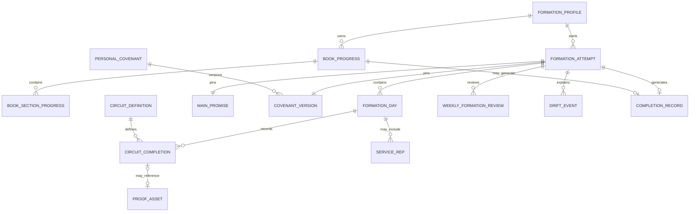
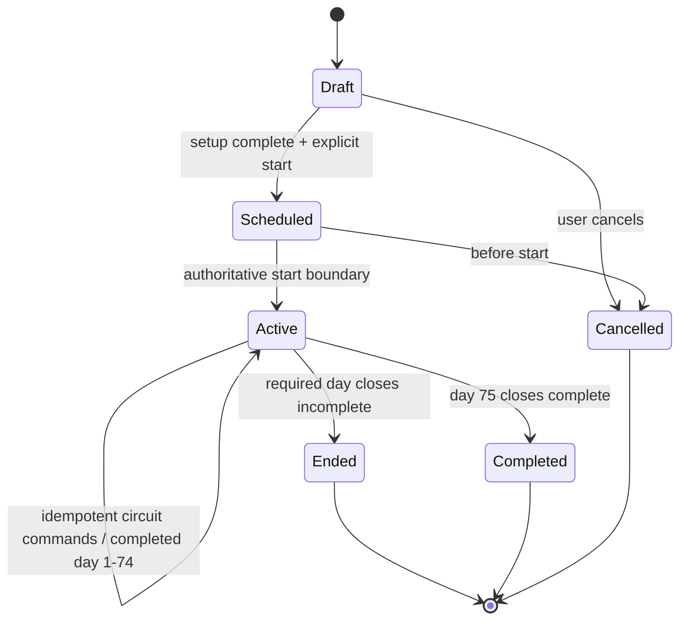

# Christian Formation Domain Model

Status: proposed contract for the first implementation PR

Naming: TypeScript uses `PascalCase`/`camelCase`; Postgres uses `snake_case`

Authority: pure rules calculate eligibility; transactional server commands persist authoritative state

## Design constraints

- The formation domain is independent of React, TanStack Query, Supabase clients, XP, and presentation copy.
- Every structured attempt is pinned to a `rules_version` and relevant content versions.
- Strict history is append-only. Corrections add audit records or superseding facts; they do not mutate the meaning of a completed/ended attempt silently.
- The server derives authoritative local dates from an IANA timezone policy. Client dates are evidence, not authority.
- All mutating commands carry an idempotency key/device event ID and expected aggregate version.
- Private content is split from progress metadata so a screen or notification can query status without loading reflection, covenant, wellness, or service text.
- Existing tables are linked through provenance fields. Legacy records are not rewritten and cannot be converted into active strict-day credit.

## Ubiquitous language

| Term | Meaning |
|---|---|
| Formation profile | Formation-specific preferences and migration state for an authenticated account. |
| Track | Read Along, 40-Day Charge, or Fully Charged: 75 Days. |
| Attempt | One bounded run of a structured track. Read Along has progress, not a restartable attempt. |
| Formation day | The authoritative per-attempt local calendar/training day state. |
| Circuit | One of Awareness, Perspective, Habit, Wellness, or Environment. |
| Completion | Evidence that a circuit/day met the rules version; not a claim of spiritual worth. |
| Closeout | The idempotent command that evaluates and seals a day. |
| Recovery Win | An honest return after drift in a non-strict path; it never repairs a missed strict day. |
| Main Promise | The person's chosen concrete promise for the active structured path. |
| Covenant | User-authored wellness/nutrition/hydration boundaries and acknowledgements, versioned over time. |
| Service rep | Private attestation of service or encouragement, with no recipient identity required. |
| Proof asset | Optional private evidence metadata and storage object. |
| Completion record | Immutable record generated when an eligible path/attempt completes. |

## Required enums

These values are stable machine IDs. Customer copy is mapped separately so it can be reviewed without changing historical semantics.

```ts
export type BookStatus =
  | "not_started"
  | "reading_now"
  | "finished"
  | "rereading_or_leading";

export type TrainingTrack =
  | "read_along"
  | "charge_40"
  | "fully_charged_75";

export type AttemptStatus =
  | "draft"
  | "scheduled"
  | "active"
  | "ended"
  | "completed"
  | "cancelled";

export type FormationDayStatus =
  | "not_open"
  | "open"
  | "pending_sync"
  | "ready_to_close"
  | "completed"
  | "incomplete"
  | "not_required";

export type CircuitType =
  | "awareness"
  | "perspective"
  | "habit"
  | "wellness"
  | "environment";

export type FormationSeason =
  | "be_with_jesus"
  | "become_like_jesus"
  | "do_what_jesus_did";

export type EvidenceClassification =
  | "attestation"
  | "text_note"
  | "photo"
  | "activity_import"
  | "legacy_record"
  | "reviewed_exception";

export type ProofVisibility = "private" | "shared_export";

export type MovementAdaptation =
  | "standard"
  | "walking"
  | "mobility"
  | "rehabilitation"
  | "recovery"
  | "indoor_safety_alternative";

export type RecoveryReason =
  | "missed_practice"
  | "health"
  | "caregiving"
  | "travel"
  | "schedule_disruption"
  | "technology_issue"
  | "other_private";

export type ContentReviewStatus =
  | "draft"
  | "theological_review"
  | "safety_review"
  | "approved"
  | "published"
  | "retired";
```

Additional internal enums are recommended:

```ts
export type SyncStatus = "server_confirmed" | "pending" | "conflict" | "rejected";
export type SourceKind = "native" | "browser_import" | "legacy_link" | "integration" | "support_correction";
export type ReflectionKind = "daily" | "weekly" | "attempt_ended" | "completion" | "chapter";
export type ContentProvenance = "scripture" | "historical_evidence" | "tradition" | "pastoral_application" | "creative_reconstruction";
```

Do not model these values as Postgres enums initially. Versioned text columns with `CHECK` constraints are easier to extend safely across independently deployed frontend/backend versions. Generate TypeScript literal unions from a shared source and test database parity.

## Entity model

### `formation_profiles`

One per authenticated user.

| Column | Notes |
|---|---|
| `user_id uuid primary key` | References `auth.users`; owner scope. |
| `book_status text` | Current BookStatus. |
| `book_edition_id uuid null` | Chapter/edition mapping. |
| `configured_timezone text` | Valid IANA timezone. |
| `preferred_track text null` | Preference, not active-attempt authority. |
| `formation_onboarding_version int` | Separate from current Life OS onboarding. |
| `migration_status text` | `not_offered`, `offered`, `in_progress`, `complete`, `needs_attention`. |
| `privacy_settings jsonb` | Typed, versioned non-secret preferences; avoid private prose. |
| timestamps | Server-generated. |

### `book_progress`

One row per user/book edition, with child rows or JSON only for compact section IDs. Prefer normalized `book_section_progress` for queryability and immutable mappings.

- `id`, `user_id`, `book_edition_id`, `status`, `current_section_id`
- `started_at`, `paused_at`, `completed_at`, `updated_at`
- `source_kind`, `source_ref`, `import_batch_id`
- unique `(user_id, book_edition_id)`

`book_section_progress` stores `section_id`, completion state/time, optional practice state, and content version. Reflections are separate.

### `formation_attempts`

Aggregate root for `charge_40` and `fully_charged_75`.

- `id`, `user_id`, `track`, `status`
- `sequence_number` per user/track; supports “Attempt 1,” “Attempt 2” without failure labeling
- `rules_version`, `content_bundle_version`
- `planned_start_local_date`, `started_at`, `ended_at`, `completed_at`, `cancelled_at`
- `start_timezone`, `timezone_policy` (`fixed` is the recommended v1 default)
- `current_timezone`, `aggregate_version bigint`
- `previous_attempt_id null`, `end_reason_code null`
- `strict_opt_in_at null`, `rules_accepted_at null`, `covenant_version_id null`, `main_promise_id null`
- `created_at`, `updated_at`

Constraints:

- track is structured (`charge_40` or `fully_charged_75`);
- strict fields are required for Fully Charged before activation;
- one active/scheduled attempt per user per structured track via partial unique index;
- terminal attempts cannot return to active;
- `previous_attempt_id` belongs to the same user/track and is never self-referential;
- security-definer functions, not clients, perform state transitions.

### `formation_days`

One row per attempt and canonical day number/local date.

- `id`, `attempt_id`, `user_id` (denormalized for simple RLS), `day_number`
- `local_date`, `timezone_used`, `utc_open_at`, `utc_close_at`
- `status`, `rules_version`, `aggregate_version`
- `opened_at`, `ready_at`, `closed_at`, `incomplete_at`
- `closeout_idempotency_key null`, `closeout_summary jsonb`
- unique `(attempt_id, day_number)` and `(attempt_id, local_date)`

For 75 Days, rows are consecutive day numbers 1–75. For 40-Day Charge, final row semantics depend on the open product decision about calendar versus completed formation days.

### `circuit_definitions`

Versioned content/rule metadata, not user state.

- `id`, `circuit_type`, `track`, `rules_version`, `content_version`
- `name`, `short_description`, `requirement_schema jsonb`
- `required`, `effective_from`, `retired_at`
- content provenance/review reference
- unique `(track, circuit_type, rules_version, content_version)`

The application consumes typed, validated schemas. Arbitrary JSON cannot introduce new completion logic; the pure rules version interprets supported fields.

### `circuit_completions`

One authoritative completion per day/circuit, with append-only event provenance.

- `id`, `formation_day_id`, `attempt_id`, `user_id`, `circuit_type`
- `definition_id`, `evidence_classification`, `source_kind`, `source_ref`
- `client_occurred_at`, `server_received_at`, `timezone_observed`
- `device_event_id`, `idempotency_key`, `sync_status`
- `details jsonb` containing only typed, non-prose requirement facts
- `proof_asset_id null`, `supersedes_id null`, `revoked_at null`, `revoke_reason null`
- unique `(user_id, idempotency_key)` and a partial unique active completion `(formation_day_id, circuit_type) where revoked_at is null`

Sensitive prose belongs in `formation_reflections`, not `details`.

### `main_promises`

- `id`, `user_id`, `attempt_id`, private `promise_text`
- `created_at`, `ended_at`, `visibility` fixed to private in v1
- revisions create a new row and explicit `supersedes_id`; strict rules define whether revision is allowed after activation

Daily Habit completion references the promise ID and records a private attestation, not duplicate text.

### `personal_covenants` and `covenant_versions`

`personal_covenants` owns identity and user/attempt relationship. `covenant_versions` stores encrypted/private user-defined nutrition, hydration, movement-safety acknowledgements, hash, revision number, and acceptance timestamps.

An active strict attempt pins one covenant version. Editing it must follow a product-approved rule: the safe recommendation is audited future-effective changes for health/safety, never rewriting earlier days.

### `recovery_wins`

- `id`, `user_id`, `attempt_id null`, `track`, `local_date`
- `reason`, optional private reflection ID, `eligible_under_rules_version`
- `source_event_id`, timestamps

Allowed for 40-Day Charge and general history. It is never a circuit completion and never reopens an ended 75-day attempt.

### Formation season

`FormationSeason` is a deterministic value, not a mutable table:

```ts
seasonForDay(day: number): FormationSeason | null {
  if (day >= 1 && day <= 25) return "be_with_jesus";
  if (day >= 26 && day <= 50) return "become_like_jesus";
  if (day >= 51 && day <= 75) return "do_what_jesus_did";
  return null;
}
```

Content assignments store the calculated season plus rules/content version so history remains explainable.

### `scripture_assignments`

- `id`, `user_id`, `attempt_id/book_progress_id`, `formation_day_id/section_id`
- `content_item_version_id`, translation/license metadata reference
- `assigned_at`, `completed_at null`

The text itself is governed content, not copied into private progress rows unless licensing permits it.

### `witness_objectives`, `witness_progress`, and `witness_evidence`

These represent private, concrete practice objectives without turning spiritual formation into a public score.

- Objective: user/attempt, stable type, neutral label, rules/content version, active window.
- Progress: objective, numeric/boolean state defined by typed schema, local date, server timestamps.
- Evidence: progress record, evidence classification, optional proof/reflection link, visibility private.

“Witness” means an account of practiced action. Customer copy must avoid implying that database evidence validates faith.

### `ego_signals`

Optional, private, user-confirmed observations.

- `id`, `user_id`, `attempt_id null`, `signal_type`, private note/reflection link
- `suggested_by_ai boolean`, `confirmed_by_user_at`, `dismissed_at`
- AI suggestions are not persisted as user facts until confirmed.

Do not infer pathology, sin status, or spiritual standing. Do not include signal text in notifications or analytics.

### `service_reps`

- `id`, `user_id`, `attempt_id`, `formation_day_id null`, `local_date`
- `service_type` from a coarse, non-sensitive allowlist; `attested_at`
- optional private reflection/proof IDs
- no required recipient name, contact information, exact location, image, or public post

For v1 strict rules, a required daily service/encouragement action is evaluated as part of the Environment requirement while remaining a separate private record. This is a provisional decision pending product confirmation.

### `proof_assets`

- `id`, `user_id`, `storage_bucket`, opaque `storage_path`
- `mime_type`, `byte_size`, dimensions, sanitized hash
- `evidence_classification`, `visibility` (`private` by default)
- `captured_at`, `uploaded_at`, `deleted_at`, `retention_policy`
- `source_kind`, `source_ref`, optional import batch

The bucket is private. Signed URLs are short lived. A `shared_export` records the exported derivative, not a permanent public bucket ACL. Strip EXIF/GPS before upload.

### `formation_reflections`

- `id`, `user_id`, optional attempt/day/book section links
- `kind`, encrypted/private `body`, `content_version`
- `ai_processing_allowed boolean default false`, `ai_processed_at null`
- `source_kind`, `source_ref`, timestamps, soft-delete/export metadata

Progress read models must not select `body`.

### `drift_events`

Neutral operational record for 40-Day recovery and strict attempt endings.

- `id`, `user_id`, `attempt_id`, optional day ID
- `kind` (`missed_requirement`, `user_paused`, `sync_conflict`, `health_safety`, `other_private`)
- coarse reason only; optional private reflection link
- `occurred_at`, `resolved_at`, `resolution`

### `weekly_formation_reviews`

- `id`, `user_id`, `attempt_id`, `week_number`, date range
- private response/reflection links, adaptation choices, service summary boolean
- `content_version`, `completed_at`
- unique `(attempt_id, week_number)`

### `completion_records`

Immutable, generated only by a server command after rules evaluation.

- `id`, `user_id`, `track`, optional `attempt_id` or `book_progress_id`
- `rules_version`, `content_bundle_version`
- `completed_at`, final day/section counts, non-sensitive summary hash
- `record_version`, `supersedes_id null`, `revoked_at null`, audited reason
- unique idempotent source (`attempt_id` for structured path; book/version for Read Along)

A completion record may power a private milestone. It must not state or imply divine approval or superior maturity.

### Supporting entities

The requested entities need these supporting records to operate safely:

- `formation_rule_sets`: immutable rule version, effective dates, serialized public configuration, code build identifier, review/approval references.
- `formation_content_items` and versions: see content governance.
- `formation_migration_batches/items`: idempotent import ledger with source and errors.
- `formation_audit_events`: actor, command, aggregate, prior/new version, request ID, coarse result; no private prose.
- `formation_timezone_changes`: old/new IANA zone, requested/effective timestamps, reason category, review state.
- `formation_device_events`: optional durable inbox for offline commands before reconciliation.
- `formation_feature_enrollments`: server-side cohort and kill-switch state if the existing feature-flag system cannot express it safely.

## Relationships



## Track rules

### Read Along

- Has `book_progress`, not a strict attempt.
- No calendar deadline or restart state.
- A section can be unstarted, available, current, completed, or hidden by the spoiler policy.
- Proof/reflection/practice are optional and do not block section progress unless the user explicitly chooses a personal plan that says otherwise.
- Pause changes recommendations only; it does not change earned progress.

Spoiler safety inputs are book status, edition map, completed/current section, and requested content section. Recommended policy:

- `not_started`: orientation and sample only.
- `reading_now`: current and completed sections visible; later narrative/application details hidden.
- `finished` or `rereading_or_leading`: all approved sections visible.
- Unknown edition/mapping: fail closed to the last user-confirmed section.

### 40-Day Charge

Provisional state model until cadence is decided:

- `draft → scheduled → active → completed`
- `active → cancelled` only by explicit user action; history remains.
- Missed work creates a drift opportunity, not an ended attempt.
- Recovery Win eligibility requires an older relevant practice, an absence/missed practice under the rules version, and a genuine return today; never award more than once for the same return event.
- All five circuits must meet the approved journey cadence by completion. The exact minimum per day/week is blocking.
- Safe movement adaptations are first-class, not exceptions with lower status.

### Fully Charged: 75 Days

Activation preconditions:

- explicit strict opt-in and current rules acceptance;
- valid IANA timezone and timezone policy;
- Main Promise;
- accepted personal covenant version;
- environment preparation acknowledgement;
- privacy/safety acknowledgement;
- no other active Fully Charged attempt.

Every local day requires all five circuits. Wellness contains two qualifying movement blocks, at least one qualifying outdoor block unless a reviewed safety alternative applies, and covenant attestation. Environment contains environment preparation/action and a private service/encouragement rep under the provisional v1 model.

State transitions:



An ended attempt never transitions back to active. “Begin again” validates readiness and creates a new draft attempt with `previous_attempt_id`; it does not clone completion rows.

## Pure rules API

The first implementation PR should expose pure functions similar to:

```ts
type RuleResult<T> =
  | { ok: true; value: T; reasons: readonly string[] }
  | { ok: false; code: string; reasons: readonly string[] };

currentFormationDay(input): RuleResult<DayPosition>;
trackProgress(input): TrackProgress;
seasonForDay(dayNumber): FormationSeason | null;
requiredCircuits(input): readonly CircuitRequirement[];
evaluateDayCompletion(input): DayEvaluation;
evaluateAttemptCompletion(input): AttemptEvaluation;
shouldEndAttempt(input): EndEvaluation;
startNewAttempt(input): RuleResult<NewAttemptPlan>;
readAlongVisibility(input): ContentVisibility;
recoveryWinEligibility(input): Eligibility;
movementAdaptationEligibility(input): Eligibility;
nextRecommendedAction(input): RecommendedAction;
eveningCloseoutAvailability(input): Availability;
generateCompletionRecord(input): RuleResult<CompletionRecordDraft>;
```

Functions consume immutable value objects and an explicit `rulesVersion`; they do not read the clock, database, environment variables, locale, or user agent. Callers inject an instant and timezone. Unsupported rule versions fail closed.

## Temporal policy

Recommended v1 policy for Fully Charged:

1. Pin the attempt to a valid IANA timezone at activation.
2. Define a formation day as `[00:00, next 00:00)` in that zone using a Temporal-compatible library, never a 24-hour duration.
3. The server computes `day_number`, `local_date`, open, and close instants.
4. Capture client event instant/observed timezone/device ID for offline evidence, but never accept a client-supplied day number as authority.
5. A durable offline event created within the day may be reconciled during a short, product-approved grace window. It enters `pending_sync`; the UI must not show server-confirmed closeout prematurely.
6. An event first created after the day boundary cannot backfill the prior day. Clock rollback, stale timezone, duplicates, and conflicting payloads go to `conflict` or `rejected`.
7. Travel does not silently shift the attempt. V1 keeps the start timezone fixed. A later version may allow an audited timezone change effective at a future unambiguous boundary.
8. DST is handled by zoned calendar boundaries; the local day may be 23 or 25 hours.

The grace duration and support-review authority are blocking decisions. Do not encode them as scattered constants.

## Command contracts

All commands require authenticated user identity from the server context, not the request body.

### `start_formation_attempt`

Input: track, planned local date, timezone, rules version, setup record IDs, idempotency key.

Output: attempt ID/status/version and authoritative first-day boundary.

Checks: eligibility, strict consent, owner relationships, active-attempt uniqueness, supported versions.

### `record_circuit_completion`

Input: attempt ID, circuit type, typed requirement facts, evidence reference, client occurrence data, device/idempotency key, expected aggregate version.

Output: canonical day, sync status, circuit evaluation, updated aggregate version.

Checks: active attempt, authoritative day, schema/rules, proof ownership, duplicate/conflict behavior.

### `close_formation_day`

Input: attempt/day ID, idempotency key, expected version.

Output: completed/pending/conflict/incomplete evaluation, missing requirements, attempt status/version.

Checks: closeout window, all active completions, pending offline inbox, transactional day+attempt update. Repeated identical calls return the same result.

### `end_overdue_attempts`

Signed scheduler/internal database job. Selects due active attempts, locks each aggregate, reconciles pending events, evaluates the pinned rule version, and ends only those definitively incomplete. Retries are idempotent.

### `begin_again`

Input: ended attempt ID, new setup/version acceptance, start date, idempotency key.

Output: new draft/scheduled attempt linked to the old one.

Checks: previous attempt terminal, same owner/track, no active duplicate. No completion data is copied.

### Read/projection contracts

- `get_formation_today`: status-only path read model; no reflection/covenant/service text.
- `get_attempt_history`: attempts/days/completion counts with opt-in links to private detail.
- `get_read_along`: spoiler-filtered server projection; the client never receives hidden content and merely conceals it.
- `get_migration_inventory`: counts, mappings, and errors without loading private bodies until requested.

## Concurrency and idempotency

- Unique `(user_id, idempotency_key)` rejects duplicate command application.
- The stored command result is returned for a byte-equivalent retry. Reusing a key with a different payload returns conflict.
- Lock the attempt row during closeout/restart or use `aggregate_version` compare-and-swap inside one transaction.
- Circuit uniqueness prevents two active completions for the same day/type. A correction supersedes or revokes through a server command.
- Completion record generation is unique by attempt/book milestone and occurs in the same transaction as terminal completion or from an idempotent outbox consumer.
- Notifications and analytics use an outbox keyed by domain event ID; retries cannot duplicate user-facing messages.

## Legacy mapping

| Legacy source | New relationship | Strict credit? |
|---|---|---|
| `daily_rings` | Historical circuit-like activity with `legacy_record` classification | No |
| `completed_actions` / mission text | Historical action or optional promise link | No |
| `integrity_logs` | Historical kept-promise evidence | No |
| `reset_sessions` / `daily_resets` | Legacy snapshot attempt/history and reflection links | No |
| browser Read Along | Imported book/section progress after user confirmation | Yes for reading progress when mapping is reliable; never strict-day credit |
| browser Dex | Imported private proof asset/metadata after confirmation | Only as historical proof |
| `ig_proof_entries` | Private migrated legacy proof and provenance | Only as historical proof |
| timeline snapshots | Rebuildable historical projection | No |

Every import item has a unique `(user_id, source_kind, source_ref, target_kind)` so reruns are safe.

## Invariants to test at every layer

1. No strict attempt activates without explicit current-version consent and setup.
2. At most one active/scheduled attempt exists for a user/structured track.
3. Historical rules/content versions remain resolvable.
4. A terminal attempt never becomes active again.
5. Begin-again never deletes or reassigns earlier days/completions.
6. A strict completed day contains valid completions for every requirement under its pinned version.
7. Day 75 completion and the completion record are atomic/idempotent.
8. A user cannot act on another user's attempt, day, reflection, proof, service rep, or covenant.
9. A delayed event cannot silently fabricate a prior day.
10. Read Along hidden content is filtered server-side.
11. Movement adaptation produces equal completion status when eligible.
12. Private text is never present in progress projections, analytics, notification jobs, or audit payloads.

## Decisions required before schema finalization

- 40-Day calendar/cadence/pause rules.
- Whether service is a nested Environment requirement or a separate daily requirement.
- Strict offline grace interval and conflict-review authority.
- Fixed timezone versus controlled travel changes after v1.
- Outdoor safety-alternative approval/attestation rules.
- Covenant revision policy during an active strict attempt.
- Exact book editions/chapter identifiers and spoiler boundaries.
- Data encryption approach for private prose and whether field-level encryption is required beyond Supabase at-rest encryption.
