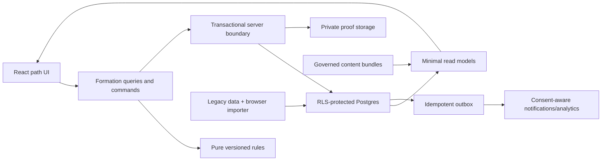
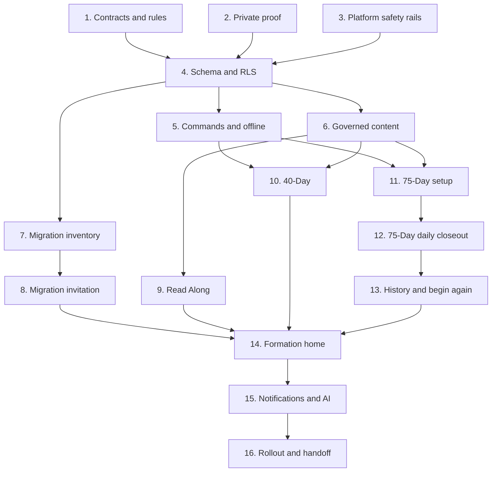

# Christian Formation Implementation Plan

Status: proposed; no implementation has begun

Delivery style: additive schema, backward-compatible APIs, client/server feature flags, small cohort rollout, legacy data preserved

## Architecture summary

Keep React/Vite, React Router, TanStack Query, Supabase Auth/Postgres/Storage/Edge Functions, and the existing shadcn/Radix/Tailwind shell. Add a strict TypeScript formation domain that has no UI/database dependencies. React consumes path-specific read models and submits typed commands; it never decides authoritative completion. Transactional Postgres RPCs or narrowly scoped edge functions evaluate the pinned rules version, enforce idempotency/concurrency, update attempts/days, and publish outbox events. Private text and proof are separated from status projections. Content and rules are independently versioned. A migration ledger links/imports legacy and browser-only data without rewriting it.

## Delivery rules

- Every PR is safe to deploy with its user-facing flag off.
- Backend accepts both the previous and new client until cohort rollout completes.
- Schema changes are additive. Rollback disables writes/read routes; it does not drop user data.
- Strict mutations are unavailable until rule, RLS, timezone, idempotency, proof, and scheduler gates pass.
- Existing Life OS routes and history remain accessible throughout rollout.
- Each schema PR regenerates `src/integrations/supabase/types.ts` and tests clean plus upgraded migration replay.
- No PR adds spiritual score, leaderboard, public proof default, or retroactive strict credit.

## Feature flags and rollout controls

Flags must be enforced server-side for writes, not trusted from `src/lib/featureFlags.ts` alone.

| Flag | Initial state | Purpose |
|---|---|---|
| `formation_read_models` | internal | New status/history projections |
| `formation_migration_inventory` | internal | Read-only existing-data inventory |
| `formation_browser_import` | off | Consent-based local data import |
| `formation_path_invitation` | off | Returning-user migration UX |
| `formation_read_along` | internal | New spoiler-safe Read Along |
| `formation_charge_40` | internal | 40-Day journey |
| `formation_fully_charged_setup` | internal | Strict readiness/setup |
| `formation_fully_charged_writes` | off | Strict circuits/closeout commands |
| `formation_closeout_scheduler` | off | Automatic overdue evaluation |
| `formation_private_proof` | internal | New proof upload/access |
| `formation_notifications` | off | Formation email/push |
| `formation_ai_context` | off | Granular-consent AI context |
| `formation_home` | internal | Path-aware home/navigation |
| `formation_legacy_archive` | internal | Preserved history surface |
| `formation_global_kill_switch` | ready/on-demand | Stops new writes while retaining read access |

Recommended cohorts: local/test → staff accounts → invited test accounts → 1% opt-in returning users → 5% → 25% → 100% eligible users. Strict mode advances separately and more slowly than Read Along/40-Day. Rollback criteria include any cross-user access, lost history, unexplained attempt ending, duplicated closeout/completion, material unsafe content, or sync-conflict spike above the approved threshold.

## PR sequence

### PR 1 — Formation contracts, temporal policy, and rules engine v1

**Product outcome:** A stable, dependency-light definition of all three paths and strict state transitions exists without changing production behavior. This is the recommended first implementation PR.

**User stories:** As a future user, my path behaves consistently across screens/devices; as a returning user, historical attempts retain their original rules; as an engineer/reviewer, I can inspect and test every completion rule outside React.

**Files likely to change:** new `src/domain/formation/{types,schemas,temporal,rules,stateMachine,readAlong,fixtures}.ts`; `src/lib/featureFlags.ts`; `package.json` and the chosen lockfile to reconcile the existing `@dnd-kit` drift and add a Temporal-compatible dependency if needed; new `tests/unit/formation/*.test.ts`; CI test config.

**New data structures:** TypeScript enums/value objects/results for every entity and required enum in [domain-model.md](./domain-model.md), `RuleSetV1`, `LocalDayBoundary`, command/result DTOs, golden fixtures. No persisted rows.

**Migrations:** None.

**APIs or server actions:** Pure function contracts only; no endpoint or write.

**UI components:** None; flags stay off.

**Analytics events:** None.

**Unit tests:** All tracks; days 1/25/26/50/51/75; missing rules; season; requirements; closeout; completion; begin-again plan; spoiler rules; Recovery Win; adapted movement; next action; DST/timezone/offline inputs.

**Integration tests:** Contract serialization/parity fixtures and current feature-flag behavior.

**End-to-end tests:** None; production behavior unchanged.

**Risks:** Unresolved 40-Day cadence, service placement, offline grace, and travel policy can leak into the contract. Encode explicit provisional policy objects and fail closed instead of hiding decisions in UI constants.

**Rollback plan:** Revert unused domain files/dependency and leave flags off; no data rollback.

**Definition of done:** `npm ci` succeeds from a clean checkout with one reviewed package-manager convention; pure functions read no clock/database/browser state; old rule fixtures are immutable; unsupported versions fail closed; proposed test commands pass; docs record provisional decisions and exact observed results.

### PR 2 — Contain legacy proof exposure and add private proof storage

**Product outcome:** No new formation proof can become publicly addressable, and legacy public proof has a measurable, recoverable migration path.

**User stories:** My proof is private by default; I can attest without a photo; existing proof remains available to me while it is secured.

**Files likely to change:** `src/pages/Proof.tsx`, `src/pages/ControllablesDex.tsx`, `src/hooks/useIGProof.ts`, `src/hooks/useControllablesDex.ts`, `src/components/dashboard/PhotoProofCapture.tsx`, `src/lib/shareProof.ts`; new proof data-access module/edge functions; storage migrations; generated types; privacy tests.

**New data structures:** `proof_assets`, optional `proof_share_exports`, storage migration ledger, sanitized metadata/hash/visibility/source fields.

**Migrations:** Create private `formation-proof` bucket, owner policies, tables/RLS, legacy object mapping; do not delete public objects in the deploy migration.

**APIs or server actions:** authorize upload, finalize sanitized upload, issue short signed URL, delete asset, create/delete share derivative, inventory/copy/verify legacy object.

**UI components:** Private-by-default proof picker, attestation alternative, explicit share preview, legacy migration status; keep old view available behind a flag.

**Analytics events:** proof method, upload/sanitize outcome, migration count/error, share-export action—never URL/hash/caption.

**Unit tests:** MIME/size/schema, visibility defaults, EXIF sanitizer, share allowlist, import mapping/idempotency.

**Integration tests:** bucket RLS/guessed paths/signed expiry/delete; copy verification; owner/other-user; retry and partial-copy recovery.

**End-to-end tests:** owner upload/view/delete/share derivative, non-photo path, second-user denial, legacy record still accessible.

**Risks:** Public URLs may already be cached/shared; base64 browser records may exceed upload limits; image conversion can lose data. Treat confirmed exposure under the incident policy and keep checksummed recovery until verification.

**Rollback plan:** Disable new upload/share, retain private copies and mapping, keep owner-only metadata read; do not restore public writes.

**Definition of done:** No new formation object uses a public ACL; all authorization/storage tests pass; public-object removal is a separate approved run after copy verification; support/export path exists.

### PR 3 — Authentication, analytics, and deployment safety rails

**Product outcome:** Formation endpoints fail closed, sensitive surfaces emit only allowlisted telemetry, and frontend/backend releases have quality gates.

**User stories:** My private formation content is not copied into analytics/error logs; scheduled communications cannot be triggered by an unauthenticated caller.

**Files likely to change:** `supabase/config.toml`, `supabase/functions/send-push-nudge/index.ts`, shared auth/scheduler helpers, analytics/Sentry initialization, `src/lib/featureFlags.ts`, `.gitignore`, `.env.example`, `.github/workflows/deploy-pages.yml`, tests.

**New data structures:** signed scheduler request/replay record if needed; typed analytics event allowlist; server feature enrollment/kill-switch storage if absent.

**Migrations:** Minimal replay/feature enrollment table and policies if required; no formation history.

**APIs or server actions:** split public VAPID-key read from privileged push delivery; reusable JWT/admin/scheduler verification; scrubbed error boundary.

**UI components:** Privacy-safe analytics boundary around sensitive routes; no visual redesign.

**Analytics events:** only security/flag outcome counts; validate that canary private text never appears.

**Unit tests:** auth-mode matrix, scheduler signature/replay/expiry, event property allowlist, Sentry scrubber, feature-flag precedence.

**Integration tests:** every touched edge function anonymous/owner/admin/scheduler cases; CI migration/type/build gates.

**End-to-end tests:** sensitive-form canary absent from captured network telemetry; notification endpoint cannot be invoked anonymously.

**Risks:** Changing auth can break cron/webhook production callers; PostHog config may be loaded before route masking. Deploy dual-verified scheduler credentials, observe, then remove old mode.

**Rollback plan:** Roll back individual caller migration while retaining request logging/rate limits; use kill switches; never re-enable sensitive autocapture.

**Definition of done:** Auth mode documented for each relevant function; no mixed public/service endpoint; CI runs install/lint/unit/build and schema checks before publish; local env is ignored and credential history reviewed.

### PR 4 — Additive formation schema, RLS, and read-only projections

**Product outcome:** The versioned domain can be persisted securely without exposing any new write path to users.

**User stories:** My profile, path, history, private content, and versioned rules can coexist with all Life OS data; another user cannot access them.

**Files likely to change:** new timestamped migrations; `src/integrations/supabase/types.ts`; new `src/data/formation/*`; database/RLS tests; `docs/christian-formation/domain-model.md` if approved decisions alter names.

**New data structures:** rule sets, formation profiles, book/section progress, attempts, days, definitions/completions, promises/covenants, recovery wins, Scripture assignments, witness entities, ego signals, service reps, reflections, drift/reviews, completion records, audit/outbox/migration/timezone records.

**Migrations:** Add tables/checks/FKs/indexes, one-active-attempt partial uniqueness, append-only/terminal constraints, RLS, minimal status views. Rehearse clean and representative upgrades; address duplicate timeline replay separately rather than editing old migrations.

**APIs or server actions:** Read-only `get_formation_profile/today/history` with empty/default results; writes remain revoked/flagged.

**UI components:** Internal schema diagnostic screen only if needed; no customer route.

**Analytics events:** read-model latency/error with no IDs/private content.

**Unit tests:** DB literal/domain parity and projection mapping.

**Integration tests:** constraint and RLS matrix for every entity; private-body exclusion; generated-type compile; empty/upgrade migration replay.

**End-to-end tests:** Internal authenticated read returns empty formation state; other user cannot query guessed IDs.

**Risks:** A single giant migration is hard to diagnose; denormalized `user_id` can drift; schema may hard-code unresolved policies. Split migration files by concern but ship one reviewed PR; enforce owner consistency in functions/FKs.

**Rollback plan:** Turn reads off; leave additive empty tables in place. Do not drop tables automatically after any cohort data exists.

**Definition of done:** Schema matches approved domain, RLS is enabled at creation, clients cannot directly mutate rule-sensitive rows, generated types are current, and clean/upgrade/RLS suites pass.

### PR 5 — Transactional commands, idempotency, and offline event inbox

**Product outcome:** Attempts and circuit/day state can be mutated atomically and reconciled safely, but remain internal-only.

**User stories:** Retrying or using two devices does not duplicate my record; offline work has an honest pending/conflict state; no stale client can overwrite history.

**Files likely to change:** migrations/functions for domain commands, new edge/RPC wrappers, `src/data/formation/commands.ts`, an IndexedDB/offline queue module and tests, generated types.

**New data structures:** command receipt/result, device event inbox, aggregate version, sync state, outbox domain events, payload digest.

**Migrations:** Security-definer command functions with fixed search path/owner checks, command uniqueness, row/version locking, outbox indexes, scheduler lease/replay protection.

**APIs or server actions:** start attempt, record/revoke circuit completion, close day, end overdue attempts, begin again, status reconciliation. Server injects identity/time/rules.

**UI components:** Internal command harness and reusable `SyncStatusBadge`; no track UI.

**Analytics events:** command type/outcome/latency, duplicate/conflict/pending/rejected codes, no facts/private text.

**Unit tests:** queue state reducer, payload digest, retry/backoff, temporal reconciliation inputs, result mapping.

**Integration tests:** duplicate/lost-response/different-payload key; two devices; stale versions; injected mid-transaction failure; scheduler/manual race; day-75 atomic record.

**End-to-end tests:** Internal harness online/offline/reload/reconnect and conflict presentation.

**Risks:** Grace and timezone policy are unresolved; browser background execution is unreliable; SQL lock order can deadlock. Keep strict write flag off until decisions; use durable inbox, deterministic lock order, timeouts/metrics.

**Rollback plan:** Disable commands/scheduler, retain inbox and status reads, allow export; no destructive reversal.

**Definition of done:** Invariants hold under concurrency; identical retries return the stored response; different payload conflicts; pending never masquerades as complete; privileged scheduler is authenticated and idempotent.

### PR 6 — Governed content model and initial bundle

**Product outcome:** Every formation practice can be sourced, reviewed, versioned, assigned, corrected, and spoiler-filtered.

**User stories:** I can tell Scripture from application or reconstruction; my historical path retains its content/rule context; unsafe or retired content stops being newly assigned.

**Files likely to change:** content migrations, schemas/validators/scripts, `src/lib/readingLibrary.ts` and controllable definition consumers, new `src/content/formation/*`, content tests and approval manifest.

**New data structures:** content items/versions, sources/licenses/reviews, bundle manifests, edition/section/spoiler maps, assignments/correction notices.

**Migrations:** Governed content tables/RLS, immutable published-version constraints, seeded approved IDs (not unreviewed production prose).

**APIs or server actions:** bundle/assignment lookup and server-side spoiler-filtered read; permissioned publish/retire command.

**UI components:** Provenance/source label, correction notice, spoiler-safe locked summary, internal content preview.

**Analytics events:** content ID/version/provenance viewed, correction shown; no response text.

**Unit tests:** lifecycle, manifest checksum, required reviewer/license fields, season/circuit/chapter mapping, forbidden unsupported IDs.

**Integration tests:** old bundle remains resolvable, retired content not assigned, server payload excludes spoilers, publish permissions.

**End-to-end tests:** provenance/translation labels, correction, current-section visibility, accessibility of sources.

**Risks:** Rights and reviewer availability can block copy; hard-coded content may be unattributed. Launch with a smaller approved bundle rather than migrating questionable text as fact.

**Rollback plan:** Stop new bundle assignment; keep pinned versions; switch to prior approved bundle; show correction/temporary unavailable state where required.

**Definition of done:** Initial bundle has accountable approvals and rights; published rows are immutable; all channels preserve labels; no unreviewed hard-coded content is treated as authoritative.

### PR 7 — Existing-data inventory, migration ledger, and legacy archive API

**Product outcome:** The system can enumerate and preserve every required legacy category before a user chooses a new path.

**User stories:** I see what will be kept; import retries do not duplicate or erase anything; ambiguous legacy activity is labeled honestly.

**Files likely to change:** new migration service/edge function, `src/data/formation/migration.ts`, adapters for daily rings/actions/quests/integrity/resets/reflections/proof/timeline/certificates, browser-import schemas, tests.

**New data structures:** migration batch/item/status, legacy link, source checksum/version, unmapped/error records, archive projection.

**Migrations:** Migration ledger and owner-only archive view; no bulk automatic conversion.

**APIs or server actions:** get inventory; start/resume import; import typed browser batch; get archive; export unmapped/error report.

**UI components:** Internal inventory inspector only in this PR.

**Analytics events:** inventory/import category counts and coarse errors; never bodies/URLs.

**Unit tests:** each source adapter, corrupt/unknown browser versions, section mapping, date/provenance preservation, strict-credit prohibition.

**Integration tests:** rerun/no duplicates; partial failure/resume; owner isolation; legacy rows unchanged; large-account pagination.

**End-to-end tests:** Synthetic existing user inventory matches seeded counts and archive links; local import survives refresh/retry.

**Risks:** Browser data exists only on one device and may be malformed; timeline snapshots duplicate sources; public proof needs private migration first. Use source-specific mappings and never infer strict credit.

**Rollback plan:** Stop imports, retain source and ledger, continue legacy route access; allow download of local source before any clearing.

**Definition of done:** Book progress, reflections, missions/promises, proof, snapshots, and every completed Controllable category have a tested preservation route; reconciled counts and errors are visible.

### PR 8 — Returning-user invitation and path selection

**Product outcome:** Existing users choose a formation path without being reset or treated as new; new users receive a concise formation orientation.

**User stories:** I understand what changed, see preserved history, can choose any path or decide later, and do not lose access to Life OS.

**Files likely to change:** `src/pages/Home.tsx`, `src/pages/QuickStart.tsx`, `src/components/onboarding/*`, `src/hooks/useOnboarding.ts`, `src/lib/onboardingReset.ts`, `src/App.tsx`, `src/lib/appRoutes.ts`; new formation onboarding components/hooks.

**New data structures:** formation invitation version/status, path preference, migration acknowledgements; existing onboarding status is untouched.

**Migrations:** Add/extend formation profile invitation fields and consent timestamps.

**APIs or server actions:** get/acknowledge invitation, select/clear preference, trigger consented import. No strict attempt start.

**UI components:** Evolution invitation, preserved-data summary, path comparison, decide-later, import preview/result, privacy/safety orientation.

**Analytics events:** invitation viewed/dismissed, path selected, decide later, import outcome; no personal answers.

**Unit tests:** existing/new-user route decision, no reuse of forced onboarding reset, path copy/consent state.

**Integration tests:** profile/invitation version updates, multi-device idempotency, flag-off fallback.

**End-to-end tests:** old onboarded user skips new-user flow, sees history, chooses/defers; new user chooses each path; browser import consent and recoverable error.

**Risks:** Home has many gate conditions and prior forced-reset behavior. Centralize a pure entry decision and add regression fixtures for old onboarding timestamps.

**Rollback plan:** Disable invitation route and restore current Home gating; preferences/imported data remain stored and archive remains reachable.

**Definition of done:** No existing cohort is silently re-onboarded; “decide later” works; all preserved categories remain accessible; strict path choice alone does not constitute strict opt-in/start.

### PR 9 — Read Along path and chapter-progress migration

**Product outcome:** Read Along becomes a durable, pause-friendly, edition-aware, spoiler-safe path.

**User stories:** My prior reading progress is preserved; I see practices only for material I have reached; reflection/proof remain optional; pausing has no penalty.

**Files likely to change:** `src/pages/ReadAlong.tsx`, `src/hooks/useReadAlongProgress.ts`, `src/lib/readingLibrary.ts`, new formation read-along data/components, routes and tests.

**New data structures:** persisted book/section progress, edition map, optional chapter reflection/proof links, pause state.

**Migrations:** Any final read-along constraints/seed assignments; idempotent browser-section mapping entries.

**APIs or server actions:** get spoiler-filtered Read Along, confirm edition/section mapping, mark/unmark current practice where allowed, pause/resume, complete section/book idempotently.

**UI components:** Book-status/edition confirmation, section navigator, practice/reflection/proof optional affordances, pause/resume, milestone, legacy-mapping review.

**Analytics events:** section/practice/milestone IDs and status; never text or hidden content.

**Unit tests:** all statuses/editions/boundaries, pause, optionality, unknown mapping, completion idempotency.

**Integration tests:** server filters payload, browser import mapping, cross-device progress, old content bundle resolution.

**End-to-end tests:** not-started/reading/finished/rereading flows; migrated progress; network inspection confirms no spoiler payload.

**Risks:** Current eight sections may not map one-to-one to editions; rights may limit excerpts. Ask for confirmation and ship references/practices without unlicensed text.

**Rollback plan:** Flag off new path and return to legacy Read Along using untouched local source/archive; keep server copy.

**Definition of done:** No deadline/restart, optional reflection/proof, pause works, cross-device durable progress, server-enforced spoiler safety, and legacy progress reconciles visibly.

### PR 10 — 40-Day Charge journey

**Product outcome:** Users can complete a compassionate 40-day formation journey across all Five Controllables with Recovery Wins and weekly service.

**User stories:** Missing work does not erase my journey; safe movement adaptations count equally; I can return honestly and review each week.

**Files likely to change:** new `src/pages/formation/Charge40.tsx`, circuit/review/recovery components and hooks; formation commands/read models; routes/home card; governed content assignments.

**New data structures:** finalized 40-Day attempt/day/cadence state, Recovery Win, weekly objective/review, service rep, movement facts.

**Migrations:** Constraints/functions reflecting the approved 40-Day calendar/cadence/pause decisions.

**APIs or server actions:** start/pause/resume/cancel if approved; record practices; Recovery Win; weekly review/service; complete journey.

**UI components:** journey orientation, five-circuit day/week view, adaptation picker, return/recovery card, service attestation, weekly review, history.

**Analytics events:** coarse circuit/cadence/recovery/review/adaptation outcomes; no text/recipient.

**Unit tests:** all approved cadence combinations, missed work without restart, Recovery Win once, weekly service, day 40 completion.

**Integration tests:** concurrent/duplicate practice and review writes, cross-device progress, RLS/privacy, completion record.

**End-to-end tests:** start → miss → return → Recovery Win → safe adaptation → weekly review/service → complete; cancel/pause if supported.

**Risks:** Undefined cadence can produce either a disguised strict streak or meaningless completion; recovery can become gamified. Require product/content approval before migration/API changes.

**Rollback plan:** Stop starts/writes, retain read-only attempt/history, direct users to Read Along/legacy surfaces without changing their records.

**Definition of done:** Approved rules are transparent; all five circuits are covered; no missed-work restart; adaptations equal status; service private; complete history/export works.

### PR 11 — Fully Charged readiness, covenant, and scheduled start

**Product outcome:** A user can make an informed, safe, versioned strict commitment, but daily strict writes remain separately gated.

**User stories:** I understand every requirement/consequence, choose my Main Promise/covenant/timezone, prepare my environment, and can decline or schedule without pressure.

**Files likely to change:** new strict setup page/components, profile/timezone settings, covenant/promise data access, content bundle, route guards, tests.

**New data structures:** strict readiness answers, consent/rules acceptance, covenant/version, Main Promise, environment setup, scheduled attempt, fixed timezone policy.

**Migrations:** Final strict activation constraints and private-field policies; future-effective covenant revision support if approved.

**APIs or server actions:** validate readiness, save covenant version/promise privately, schedule/cancel before start, fetch rules summary; activation remains server authoritative.

**UI components:** path comparison, safety/adaptation explainer, requirements checklist, timezone preview, covenant editor, Main Promise, environment prep, consent, schedule confirmation.

**Analytics events:** step/outcome/abandon reason categories, adaptation education viewed, rules version accepted; no answers/text.

**Unit tests:** activation preconditions, consent version, timezone boundaries, covenant ownership/revision, duplicate schedules.

**Integration tests:** private fields excluded from projections/logs, one active/scheduled constraint, idempotent schedule/cancel.

**End-to-end tests:** cannot skip setup; accessibility; safe alternative/decline; schedule across DST; different user cannot read promise/covenant.

**Risks:** Setup can become coercive or collect sensitive health/diet data. Minimize fields, keep user-authored, show Read Along/40-Day alternatives, require pastoral/safety review.

**Rollback plan:** Disable new setup/start; allow scheduled users to cancel/export; retain drafts/private data with delete controls.

**Definition of done:** Strict opt-in is separate and explicit; fixed timezone/rules version visible; private setup fields pass canary tests; choice never preselected; no attempt starts with missing requirements.

### PR 12 — Fully Charged daily circuits, offline sync, and closeout

**Product outcome:** An internal/small cohort can accurately record and close each strict local day with all Five Controllables.

**User stories:** I know exactly what remains; safe movement counts honestly; offline actions show pending; closeout gives one authoritative result.

**Files likely to change:** strict daily page; five circuit cards; movement/service/evidence/closeout/sync components; IndexedDB queue/service worker coordination; command/read-model adapters; scheduler function.

**New data structures:** circuit fact schemas, two movement blocks/outdoor/adaptation facts, service rep, environment prep, closeout summary and sync conflict.

**Migrations:** Final requirement constraints/functions/outbox/scheduler indexes; no client-direct write policies.

**APIs or server actions:** record/revoke completion, upload/link proof, close day, reconcile offline, end overdue attempts, get Today/minimal missing requirements.

**UI components:** accessible five-circuit list, movement block/adaptation, private service attestation, optional proof, pending/conflict banner, evening closeout, local-time explanation.

**Analytics events:** requirement/result IDs, sync status/conflict code, day number, adaptation category; no private facts/text.

**Unit tests:** requirement schemas, current day/seasons/boundaries, closeout availability, pending/conflict UI reducer.

**Integration tests:** all concurrency/idempotency/offline/DST/timezone/scheduler races; atomic end/complete; RLS/storage/notification outbox.

**End-to-end tests:** days 1/25/26/50/51/75 via time-controlled environment; offline valid/late/conflict; two devices; adapted movement; missing each requirement; no retroactive editor.

**Risks:** This is the highest-integrity PR. Browser clocks/background sync and scheduler order can end attempts incorrectly. Keep cohort tiny, require observability/manual support hold, and never end while reconciliation is indeterminate.

**Rollback plan:** Kill new writes and scheduler, freeze affected attempts in read-only/pending-review rather than marking ended; preserve device inbox and audit.

**Definition of done:** Approved grace policy encoded once; unexplained outcomes are impossible in fixtures; identical closeout is idempotent; pending is never complete/ended; support runbook and kill switch pass a drill.

### PR 13 — Attempt history, begin again, weekly review, and completion records

**Product outcome:** Ended and completed attempts remain truthful, compassionate, reviewable, and restart-safe.

**User stories:** My ended attempt remains visible; I can reflect and begin again without erasure; day 75 produces one private milestone; I can export my history.

**Files likely to change:** new formation history/attempt detail/review/completion components and routes, begin-again command adapters, archive links, export service, content copy.

**New data structures:** end reflection, weekly review final fields, completion record/read model, begin-again link, correction/export metadata.

**Migrations:** Final uniqueness/immutability constraints and export job metadata if needed.

**APIs or server actions:** get attempt timeline/detail, save optional review/reflection, begin again, generate/retrieve completion record, export, audited correction request.

**UI components:** attempt list/timeline, “Attempt ended,” lessons prompt, Begin Again, completion milestone, rule/content version detail, legacy history link.

**Analytics events:** history viewed, begin-again initiated/completed, completion/export outcome; no reflection.

**Unit tests:** terminal states, previous-attempt preservation, completion-record generation, copy/state mapping, correction semantics.

**Integration tests:** old rows unchanged after restart; duplicate begin-again/completion; export authorization; terminal write denial.

**End-to-end tests:** missed day → ended history → optional reflection → begin again; complete day 75 → one record; compare old/new attempts; flag-off read-only.

**Risks:** Visual emphasis can shame or turn attempts into status trophies; certificate storage is currently public. Use neutral private milestones and private storage only.

**Rollback plan:** Disable begin-again/export creation while retaining read-only history; no deletion/reversion of terminal records.

**Definition of done:** Previous attempts are immutable and visible, restart creates a new sequence, completion record is atomic/idempotent/private, copy passes formation review.

### PR 14 — Path-aware formation home and navigation cutover

**Product outcome:** The app leads with the selected Christian formation path while preserving the Life OS archive and settings.

**User stories:** I see the next relevant practice, local day/sync state, book/track context, and easy access to my old data without a crowded universal dashboard.

**Files likely to change:** `src/pages/Home.tsx`, `src/App.tsx`, `src/lib/appRoutes.ts`, authenticated layout/navigation, mobile bottom nav, Today/read/mission/reset modules; new `FormationHome` composition/read-model hook.

**New data structures:** No authoritative domain changes; server home projection and navigation preference.

**Migrations:** Optional view/index for the minimal home read model; no history conversion.

**APIs or server actions:** get formation home projection/next action; all mutations use existing commands.

**UI components:** path header, next action, circuit/chapter summary, Main Promise metadata, closeout/sync, path switch/decide later, Legacy Archive entry.

**Analytics events:** home/path module viewed, next-action selected, archive opened; no auto-captured text.

**Unit tests:** pure home-entry decision across onboarding/migration/path/attempt states; loading/error/offline states; legacy module visibility.

**Integration tests:** projection excludes private bodies; staggered backend/client and flag combinations.

**End-to-end tests:** each path desktop/mobile/tablet, existing user archive, no forced onboarding, keyboard/screen reader/reduced motion/zoom/landscape.

**Risks:** Replacing Home can hide valued Life OS tools and multiply existing gate complexity. Compose from one decision/read model and roll out opt-in with an easy legacy-home escape during cohort stages.

**Rollback plan:** Server/client flag returns current Home and navigation; new routes/history remain directly accessible.

**Definition of done:** One clear path-aware next action; no formation rule in UI; all legacy preservation categories reachable; accessibility/device matrix and flag rollback pass.

### PR 15 — Consent-aware formation notifications and AI assistance

**Product outcome:** Optional reminders and AI help support the selected path without leaking content, asserting spiritual authority, or mutating state.

**User stories:** I control channel/context, lock-screen/email content is discreet, and AI uses only what I explicitly choose.

**Files likely to change:** `supabase/functions/send-daily-nudge/index.ts`, push functions/shared mission copy, `src/lib/pushNotifications.ts`, `src/components/settings/AISettingsCard.tsx`, `ProfileSettingsModal.tsx`, AI orchestrator/consent functions, formation templates/tests.

**New data structures:** formation consent scopes, notification purpose/channel/quiet hours, domain-event delivery dedupe, AI request provenance/safety metadata.

**Migrations:** Extend consent/preferences/log schemas with owner RLS and purpose/version; avoid logging message bodies.

**APIs or server actions:** update consent; preview/test notification; outbox-driven send; minimal formation context retrieval; AI suggestion with approved sources; memory inspect/delete.

**UI components:** granular settings, data preview/selection, generic reminder preview, AI label/sources, non-AI fallback, memory inspector.

**Analytics events:** opt-in/out, delivery/outcome, AI consent/tool outcome/content IDs; no generated/private text.

**Unit tests:** template privacy/shame/safety lint, timezone/quiet hours/dedupe, consent selection/revocation, AI action prohibitions.

**Integration tests:** signed scheduler, minimal queries, canary non-leakage, provider timeout, revoke-next-request, no send while pending sync.

**End-to-end tests:** opt in/out by channel, lock-screen-safe payload, AI on/off and selective context, memory delete, failed AI leaves progress unchanged.

**Risks:** Existing nudge builds from broad private Life OS context; generative output can fabricate authority/unsafe advice. Use new minimal projections, approved retrieval/templates, deterministic state boundaries, and independent kill switches.

**Rollback plan:** Disable formation notifications/AI independently; deterministic core remains fully usable; queued sends cancel by purpose/flag.

**Definition of done:** All scopes default appropriately, canary data is absent outside explicitly consented AI payload, delivery is deduped/timezone-aware, and AI cannot perform domain/share/consent commands.

### PR 16 — Cohort rollout, observability, legacy archive completion, and operational handoff

**Product outcome:** The formation system can graduate safely while legacy history remains accessible and support can explain every state.

**User stories:** I receive a stable experience, can recover/export/delete data, and get a clear explanation if synchronization or migration needs attention.

**Files likely to change:** flag/cohort configuration, admin/support status views, release/QA/telemetry docs, GitHub workflows, archive screens, runbooks, alert configuration, PWA routing/base-path config.

**New data structures:** support case grant/audit if approved, rollout cohort, health metrics/materialized operational summaries without private content.

**Migrations:** Performance indexes/policy tightening identified by cohort data; no destructive legacy drop.

**APIs or server actions:** audited operational status/retry for stuck non-sensitive jobs; export/delete completion; no silent history editing.

**UI components:** migration/sync support state, data controls, legacy archive completeness, optional “use legacy home” during rollout.

**Analytics events:** aggregate funnel/error/latency/privacy-safe reliability metrics and flag cohort; no spiritual score.

**Unit tests:** cohort assignment/kill-switch, support action permissions, archive mapping completeness.

**Integration tests:** backup/restore, flag rollout/rollback, scheduler/queue drain, export/delete, support grant expiry, partial deployment order.

**End-to-end tests:** full new/existing user suite, long/time-accelerated strict run, archive/export/delete, rollback to legacy home, production-like PWA routes.

**Risks:** Premature legacy removal, support overreach, or metric pressure can undermine trust. Set explicit stage gates; do not drop source tables/browser recovery until retention and reconciliation criteria are met.

**Rollback plan:** Reduce cohort/disable writes/notifications/AI, keep read-only formation and legacy archive, freeze ambiguous attempts for review, follow incident playbook.

**Definition of done:** Stage owners sign off; alerts/runbooks/backup/restore/export/delete/kill-switch drills pass; cohort health is stable; no required legacy data is unreachable; GA decision is documented.

## Recommended sequence and dependencies

PRs 2 and 3 can follow PR 1 in parallel only with separate owners/worktrees and migration coordination. PR 2 becomes an immediate containment hotfix ahead of PR 1 if production review confirms that users currently place sensitive proof in publicly accessible storage.

## Blocking product decisions

1. Whether 40-Day Charge uses consecutive calendar days or forty completed formation days; pause and minimum circuit cadence.
2. Whether daily service is part of Environment or an additional strict requirement.
3. Offline closeout grace duration, pending-event behavior, and whether/how an authorized reviewer can resolve conflicts.
4. Fixed attempt timezone versus future-effective travel changes.
5. Outdoor movement safety alternative and its attestation/evidence requirements.
6. Active-attempt covenant revision rules for health and safety.
7. Supported book editions, chapter mappings, excerpt/Scripture translation rights, and spoiler boundaries.
8. Minimum age, launch regions, retention/deletion SLA, and support/admin access policy.
9. Content approvers for theology, history, wellness/safety, privacy/rights, and final publishing.
10. Legacy public proof incident/remediation scope and user communication.

PR 1 can represent unresolved values as explicit policy inputs. PRs that persist or expose the affected behavior cannot graduate until the corresponding decision is approved.

## Assumptions that can safely be made

- React/Vite, React Router, TanStack Query, Supabase, and the current component system remain the stack.
- Supabase Auth user ID remains the owner key.
- New schema is additive and uses repository snake_case/generated-type conventions.
- The five stable circuit IDs are Awareness, Perspective, Habit, Wellness, and Environment.
- Fully Charged uses days 1–75 and the three specified 25-day seasons.
- A strict incomplete day ends only that attempt; history is preserved and begin-again creates a new attempt.
- Proof, service, reflections, prayer, covenant, and wellness are private by default.
- Legacy records remain source-of-truth history and never retroactively satisfy a new strict attempt.
- AI and notifications are optional layers; deterministic formation works without them.
- Legacy XP/charge can remain in the archive but does not measure formation or decide new completion.
- Feature flags and backward-compatible releases are required until data reconciliation and support gates pass.

## Riskiest technical areas

1. **Timezone/offline authority:** DST, travel, client clock changes, delayed synchronization, and scheduler races can end an attempt incorrectly.
2. **Privacy/storage:** the public legacy proof bucket, browser-only sensitive data, broad notification context, and analytics autocapture conflict with the new promise.
3. **Transactional integrity:** current mission/reset/ring/XP actions use client-coordinated multi-writes; strict completion requires atomic/idempotent commands.
4. **Migration completeness:** data is fragmented across Postgres, storage, timeline projections, and per-device local storage, with overlapping semantics.
5. **Content integrity:** current hard-coded material needs provenance, rights, spoiler mapping, and qualified review before becoming formation authority.
6. **Schema migration reliability:** numerous migrations and near-duplicate timeline migrations require clean/upgrade replay verification.
7. **Universal journey/home gates:** overlapping onboarding and one-journey assumptions can accidentally re-onboard or hide data from returning users.
8. **Safety incentives:** strict movement, daily service, proof, XP, and notifications can create compulsion, shame, or performance behavior if copy and rules drift.

## First PR to implement

Implement **PR 1: Formation contracts, temporal policy, and rules engine v1**. It is the smallest no-production-write change that makes later schema/API/UI work converge on one reviewable contract. It should include all required entities/enums as types, versioned pure rules, the strict state machine, explicit provisional policy inputs, and the full boundary fixture set. Do not add the full UI or database writes in that PR.

Security exception: if a live-data check confirms ongoing sensitive uploads to the public legacy proof bucket, pause feature sequencing and ship the containment portion of PR 2 as an incident hotfix; then return to PR 1.
